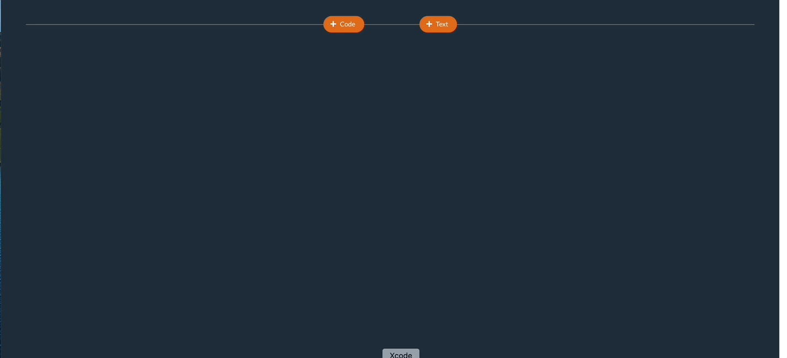
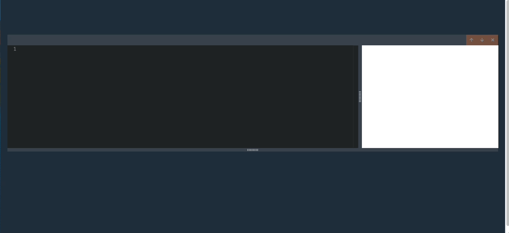
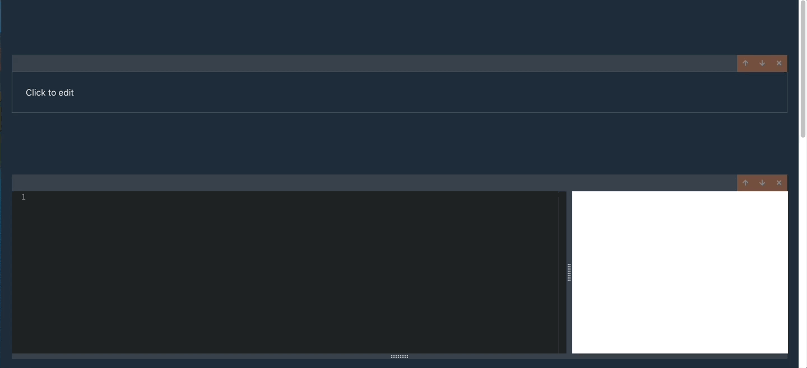
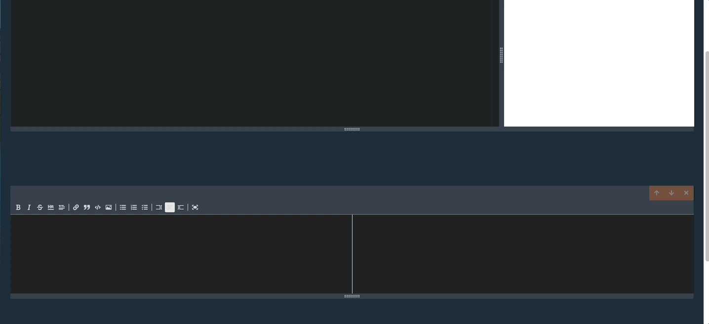
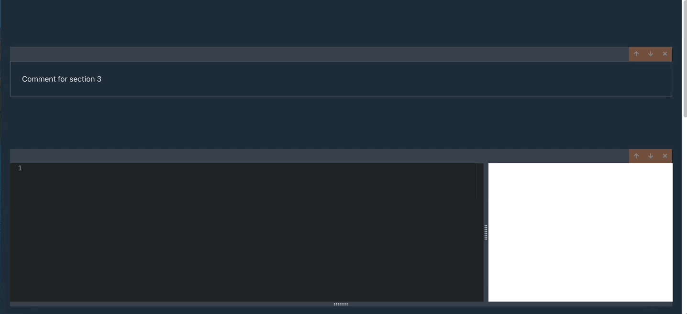
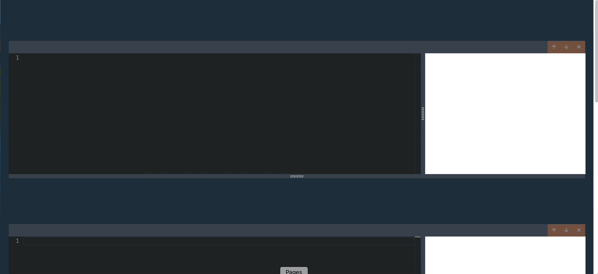

# Codeitout

Codeitout is a coding tool that allows programmers to write and test code in code editor windows, as well as add notes in text editor windows.

Users can open multiple windows to easily test multiple solutions on the same screen, and take notes on their work. 

The work that users do on the platform is saved on the local machine, so that users can continue their work, as well as export their work to other platforms. 

The project consists of three different packages which handle the ***client*** (frontend components), ***CLI***, and ***local API***.

# Getting Started

## NPM

You can also choose to access the files which are hosted on NPM. 

### NPX

The easiest way to run the platform is by running `npx codeitout serve` in your CLI. You'll want to create a new folder, 

This command will ask you permission to download necessary files from NPM, and then start your Express server right away. 

Navigate to the url on your console to see the platform. (By default this is `http://localhost:4005`)

### Install the files

You can install also the install all the packages directly onto your machine first. 

Run `npm install codeitout`.

This will give you folder with node_modules and package.json configurations. 

Navigate to `node_modules/codeitout/dist`. Once inside the directory run `node index.js serve`. Navigate to the console URL.

## Github

You can also run the server from the files available here on Github.

Clone the files into a new folder on your local machine. 

Then similiarly, go to to `nodemodules/codeitout/dist` and run `node index.js serve` and navigate to the console url. 

# Available Scripts

### `npm run start`

The project is running on Lerna which allows you to run multiple packages concurrently.

-**In the root directory**, run `npm run start` to run all of the packages in parallel. 

You can also run them individually.

-**In the CLI/local-api directories** you can run this command if you need to make any changes to the original typescript files. The start command in these packages check for any typescript file changes and automatically updates the output files.

-**In the client directory** this boots up your React application.

### `npm run build`

This command is available on the client package directory and lets you build your project manually. 

# How to use

When you first open the application, you'll need to hover to the top of the application to open your first window.



After you open your first window, you can also choose to add windows, underneath ones you've already opened.



## Code Editor

The code editor consists of two portions: the code editor and the display window. The display window is an iframe with hardcoded HTML, imports, and functions.

### Show()

In order to make it easier for users to easily utilze the display window, I've added a hardcoded `show()` function, which allows display of primitive values, arrays, objects, and JSX elements. 

*The current configuration is so that show can only be called once per code editor window*

For JSX elements in show elements just input the desired plain HTML.

For example: 

```
show(<div>
  <button className = 'btn btn-primary'>Click me!</button> 
</div>)
```


Of course you can also run functions, like this one, and use the console to observe your output.


You can also choose to write out full React components like this one, and interact with the results in the window. 

**Note that if you want to write your own `ReactDOM.render` statement, you must refer to the element with class 'root'**


The platform includes a format button which utilizes the Prettier library to format your code.


### Imports

Note that this previous example of code uses import statements so a quick note on that. The imports are coming from `https://unpkg.com/{name_of_import}`, with `name_of_import` being the package that was referenced in the quotes of the `import React from 'react'` statement. 

This statement will reference `https://unpkg.com/react/` and return the referenced package. You can visit the unpkg url to check if the import you are looking for exists.

If you want to check how to use the import, just `console.log({your_package})` to check whats included. 

You can also import CSS libraries like bootstrap using statements like this `import 'bootstrap/dist/css/bootstrap.css'`.

### Compilation in multiple windows

I wanted to consider cases where users might want to have variables, functions, and components available in other windows.

In order to consider these cases, the current set up is configured so that later windows is compiled with code that was written before. Earlier windows do **not** have access to later code. 

In this example you can see how variables already declared can be displayed in later windows. 


**Use case examples for multiple windows**

1) Create a children React components and then move on to parent components. 
2) Create a custom CSS file before using show function to display plain HTML (*For custom CSS please refer to instructions in the under the hood section*).
3) Create a vanilla Javascript file before using show function to display plain HTML.

## Text Editor

The text editor will be closed when you first add one to your screen. 

Simply click on the screen to open and start typing. 

To close, click anywhere outside the text editor.

 

The text editor provides multiple options for text styling like **bold**, *italicized*, ~~strikethrough~~.

There are also add borders and headers.

 

Other options include links, quotes, code snippets, and images. 

 

You can also create various types of lists.

 

## Window Manipulation

All windows can be resized, reordered, and deleted.

You can resize code editor windows to resize your display window, and all windows have vertical resizing.



Here's what it looks like to bring a specific window into a desired location. You can move a window up or down.



You can also delete your windows.




# Under the hood 

## Bundling

One interesting challenge for this project was trying to bundle the code for individual code snippets on a browser.

ESBuild finds all necessary file paths, and attempts to load the files when found, but relies on a file system to find the files it needs to compile, so we had to find a way around this limitation. 

Finding the necessary import file paths and loading them are performed through the library's `onResolve` and `onBuild` functions respectively, and so instead of using the default functions, I modified the library and created custom functions.

These are the custom functions

### `onResolve`

```
import * as esbuild from 'esbuild-wasm';

export const unpkgPathPlugin = () => {
  return {
    name: 'unpkg-path-plugin',
    setup(build: esbuild.PluginBuild) {
      // handle root entry index.js file
      build.onResolve({ filter: /(^index\.js$)/ }, () => {
        console.log('onBuild');
        return { path: 'index.js', namespace: 'a' };
      });

      // handle relative paths in a module
      build.onResolve({ filter: /^\.+\// }, (args: any) => {
        console.log('onBuild', args);
        return {
          namespace: 'a',
          // create new url with relative path and resolveDir statement, which is the path based on the relative 
          path: new URL(args.path, 'https://unpkg.com' + args.resolveDir + '/')
            .href,
        };
      });

      //handle main file in a module
      build.onResolve({ filter: /.*/ }, async (args: any) => {
        console.log('onBuild', args);
        // create url with args.path which is the name of the module
        return {
          namespace: 'a',
          path: `https://unpkg.com/${args.path}`,
        };
      });
    },
  };
};

```

For the custom `onResolve` function, I am trying to take various necessary file paths, and creating functions that detect these file paths with filters. 

Once I've received the argument, I return a new object which has the relevant pathname. 

There are 3 important file path arguments all with unique resolutions for their cases.

a) The `index.js` file which will have state of all my individual code cells. This case will simply return the `index.js` path.
b) Anything that is imported will first have a main module file. These files are directed with the import name in `https://unpkg.com/{module_name}`.
c) Files that are nested inside the main module file. I first got the directory in unpkg to the to the relative path, and then the filename. This was necessary, because the file path of main module often different from the directory to the relative path.

### `onLoad`

```
import * as esbuild from 'esbuild-wasm';
import axios from 'axios';
import localForage from 'localforage';

const fileCache = localForage.createInstance({
  name: 'filecache',
});

console.log(fileCache)

export const fetchPlugin = (inputCode: string) => {
    return {
        name: 'fetch-plugin',
        setup(build: esbuild.PluginBuild) {
          // for loading index.js file
          build.onLoad({ filter: /(^index\.js$)/ }, () => {
              return {
              loader: 'jsx',
              contents: inputCode,
              };
          });
          // load up cached results if pathname matches up with a certain file
          build.onLoad({filter: /.*/}, async (args: any) => {
            console.log('Returned results from a cache')
              // console.log('I ran and got cached results')
              const cachedResult = await fileCache.getItem<esbuild.OnLoadResult>(args.path);
          
              if(cachedResult){
                  return cachedResult
              }
          })
        
          // for loading css files
          build.onLoad({ filter: /.css$/ }, async (args: any) => {
            
            const { data, request } = await axios.get(args.path);

            // escaped variable is returned css file without the quotes and double quotes so that string doesn't terminate early 
            const escaped = data
            .replace(/\n/g, '')
            .replace(/"/g, '\\"')
            .replace(/'/g, "\\'");
            console.log(request, data, escaped, "FOR CSS")

            // create new style element and appended to document using Javascript
            const contents = `
            const style = document.createElement('style');
            style.innerText = '${escaped}';
            document.head.appendChild(style);
            `;
    
            const result: esbuild.OnLoadResult = {
            loader: 'jsx',
            contents,
            resolveDir: new URL('./', request.responseURL).pathname,
            };
            // set cached item for args.path
            await fileCache.setItem(args.path, result);
    
            return result;
          });
          
          // for loading all files besides css files 
          build.onLoad({ filter: /.*/ }, async (args: any) => {
            
            // use args.path in axios request
            const { data, request } = await axios.get(args.path);
            console.log(request, data, 'FOR ALL IMPORTS BESIDES CSS')
            const result: esbuild.OnLoadResult = {
              loader: 'jsx',
              contents: data,
              // detects when the url we received was a redirect, and the responseURL is different from the one that was provided 
              resolveDir: new URL('./', request.responseURL).pathname,
            };
            // set cached item for args.path 
            await fileCache.setItem(args.path, result);
    
            return result;
          });
        },
      };
}
```
For the custom `onLoad` I have a couple notable features. 

1) If we have not loaded an import file yet, we are using `axios` to make a call to unpkg.com.
2) I included a cache to improve performace. If a certain pathname has already been loaded, the pathname will have already been loaded onto our cache from the previous load, and we will simply return the data from the cache.
3) I am using filters again to refer to all required path arguments. This includes the index.js file, imports, and specifically CSS imports which has a string that needs to be manipulated and inputted into a style element.
4) We are returning a `resolveDir` property to find the exact directory which was referred to upon loading the import file.

## Frontend

### Code Preview

To handle the challenge of previewing the code for multiple code windows isolated from the original React application, I used iframes, which were loaded with hard coded HTML strings. 

```
<html>
      <head>
        <style>html {background-color: white;}</style>
      </head>
      <body>
        <div id="root"></div>
        <script>
					const handleError = (err) => {
						const root = document.querySelector('#root');
						root.innerHTML = '<div style="color: red;"><h4>Runtime Error</h4>' + err + '</div>';
						console.error(err);
					}
					window.addEventListener('error', (event) => {
						event.preventDefault()
						handleError(event.error)
					})
          window.addEventListener('message', (event) => {
            try {
              eval(event.data);
            } catch (err) {
              handleError(err)
            }
          }, false);
        </script>
      </body>
    </html>
```

This is what is included in all of the iframe windows. These are sent a message (property of an iframe) upon a user typing some code, which 1) changes the state, then 2) runs some debouncing logic to bundle the code after 750 ms of the user not typing anything. 

This solution which isolated each coding environment from the original React application as well as other coding windows, prevented the users code from affecting any irrelevant environments.

### State 

State for this application was handled using Redux, and was stored as an object, which has key-value pairs, which referred code cells' ids to relevant data (content and type of cell). I also had an order state which was stored as an array that contained just the cells' ids. 

I have a hook inside the application for accumulating the relevant code when the code editor attempts a bundle. 

```
return useTypedSelector((state) => {
const { data, order } = state.cells;
const cumulativeData = order.map((id) => data[id]);
    // cumulative code data initialized with:
    // show function - displays primitive values, objects, and JSX elements
    // React and ReactDom always imported separately to prevent import conflict 

    const showFunc = `
        import _React from 'react';
        import _ReactDOM from 'react-dom';
        var show = (value) => {
            const display = document.querySelector('#root')
            if(typeof value === 'object'){
                if(value.$$typeof && value.props){
                    _ReactDOM.render(value, display)
                } else {
                    display.innerHTML = JSON.stringify(value)
                }
            } else {
                display.innerHTML = value;
            }
        }
    `
    let diffShowFunc = `var show = () => {}`

    const cumulativeCodeData = []
    // get all content from cells before this current cell id if they have type: 'code'
    for(let c of cumulativeData){
        if(c.type === 'code'){
            if(c.id === cell_id){
                cumulativeCodeData.push(showFunc)
            } else {
                cumulativeCodeData.push(diffShowFunc)
            }
            cumulativeCodeData.push(c.content)
        }
        if(c.id === cell_id){
            break
        }
    }
    return cumulativeCodeData
```

This hook uses both order and data states in order to:
1) Accumulate all the code content from the cells before it.
2) Include the code for the show function, which handles displaying, primitive values, objects, and JSX elements. 
3) Push the functional show function before the cell id that matches the cell's id which is calling the cumulative code function.

This function is called from a code cell component with the current cell's id, which then sends the cumulative code to the bundling process.

# Libraries

Typescript: Strict syntactical superset of JavaScript which adds static typing

Axios: Promise based HTTP client

## CLI

Commander: Library for building Node.js CLI interfaces

Esbuild: Fast modern bundler; handles transpiling and bundling for the application

## Local API

Express: Node.js web application framework for creating HTTP utility methods and middlewares

Http-proxy-middleware: Node.js proxying library

## Client

### State

Redux: State management system for centralizing the state system

React-redux: Connects the React components to the Redux state

Redux-thunk: Allows Redux to incorporate async functions

Immer: Allows state change in Redux without the use of spread operators

### Components

React-resizable: Provides resizable box elements

Monaco-editor: Code editor react component

Monaco-jsx-highlighter: Syntax highlighting for monaco

Codeshift: File transformer used for monaco highlighter

Prettier: For formatting code

Bulmaswatch: CSS library

### Bundler 
Esbuild-wasm: Cross-platform WebAssembly binary for Esbuild

Localforage: For data caching
